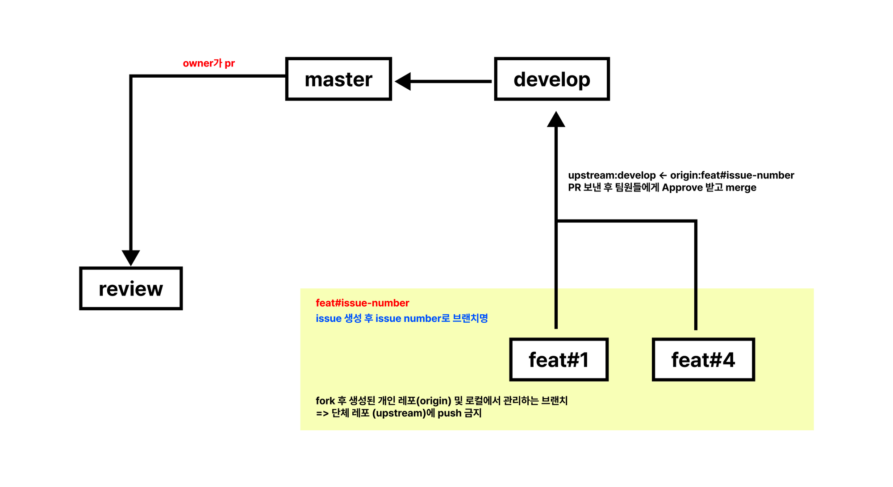
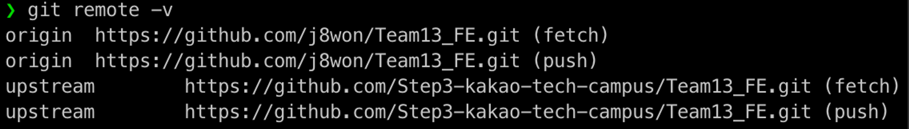
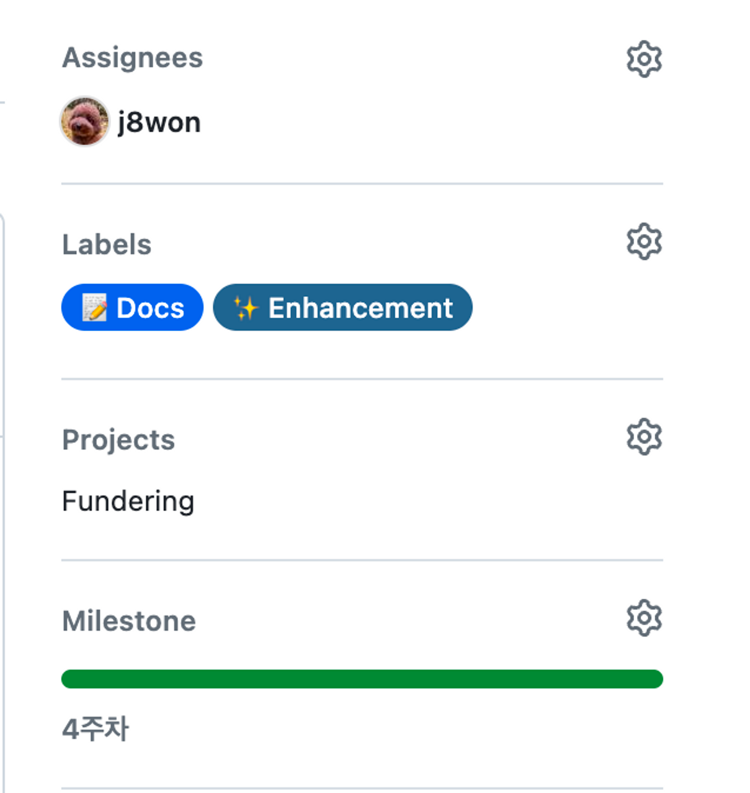
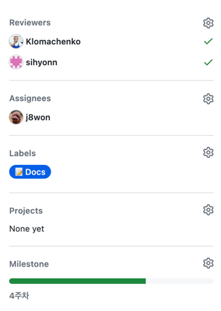

# 브랜치 전략 및 레파지토리 관리

### Fork

1. 먼저 개인 계정으로 Fork를 진행합니다.
2. 로컬에 fork한 레포를 `clone` 합니다.
    - clone 할 때 Copy the develop branch only를 해제해주세요!!!!!

   

3. 로컬 환경에서 단체 계정의 레파지토리는 `upstream`, 개인 계정으로 fork한 레파지토리는 `origin`으로 원격 저장소를 저장합니다.
    - `git remote add origin 개인 레포 url`
    - `git remote add upstream 단체 레포 url`
4. 아래와 같이 나오면 성공!

   

### Issue

1. Feature Issue Template을 활용해 이슈를 생성합니다. [예시](https://github.com/JNU-econovation/CoNoE/issues/43)
2. 이슈는 팀원이 이해할 수 있도록 자세히 작성합니다.
    1. 디자인이 있다면 첨부
3. 이슈에 Assignees와  Projects, Labels, Milestone을 추가합니다.

   

4. 팀원에게 이슈 작성을 고지합니다.
    - 팀원들은 이슈를 확인하고 코멘트 기능을 활용해 이슈에 대한 피드백을 합니다
    - 개발에 지장이 되지 않도록 최대한 빨리 확인합시다~
    - 예시: 이 기능은 추후 진행해도 괜찮을 것 같아요, 이 기능은 이렇게 개발하면 좋을 것 같아요, 좋아요 👍

### 개발

1. develop 브랜치로 이동합니다. `git switch develop`
2. 먼저 단체 계정 레포의  `develop` 브랜치를 동기화합니다. `git pull upstream develop`
3. `develop`에서 뽑아서 이슈 번호대로 feature 브랜치를 생성합니다. `git branch feat#issue-number develop`
    - 예시: `git branch feat#43 develop`

      

4. 이슈에 따라서 개발을 진행합니다.
5. 기능마다 `commit` 합니다. 커밋은 기능마다 최대한 쪼개서 하는 것이 좋아요!
6. 개발을 완료하면 개인 레포에 push 합니다. `git push origin feat#issue-number`

### PR

1. 개인 레포에서 단체 레포를 PR을 생성합니다. [pr 템플릿](https://github.com/Step3-kakao-tech-campus/Team13_FE/blob/master/.github/pull_request_template.md)
2. `upstream:develop` ← `origin:feat#issue-number`
3. PR을 작성합니다. `close #issue-number` 을 pr에 작성해두면 pr이 merge 됐을 때 해당 이슈가 자동적으로 close 상태로 바뀝니다. [예시](https://github.com/JNU-econovation/CoNoE/pull/48)
4. PR에 Reviewers, Assignees, Labels, Milestone을 추가합니다.
5. 코드 리뷰를 진행하고 Approve를 2개 받으면 PR을 보낸 사람이 Merge 합니다
   
   
